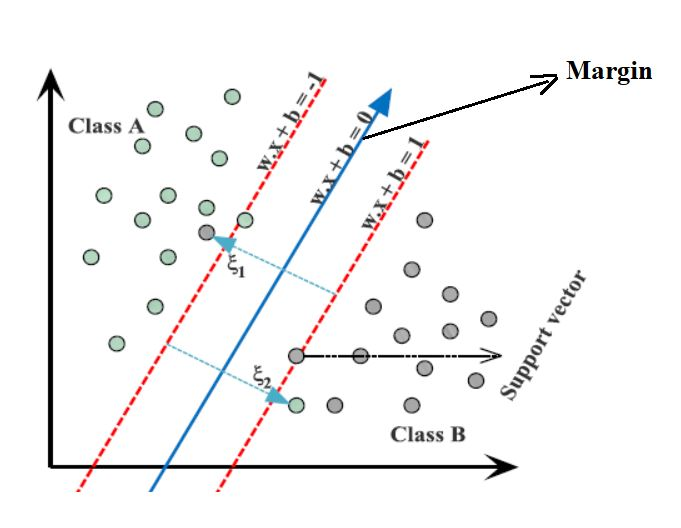

# Plagiarism Detector using AWS SageMaker

This repository contains code and associated files for deploying a plagiarism detector using AWS SageMaker.

## Project Overview

A plagiarism detector that examines a text file and performs binary classification is built; labeling that file as either *plagiarized* or *not*, depending on how similar that text file is to a provided source text. Detecting plagiarism is an active area of research; the task is non-trivial and the differences between paraphrased answers and original work are often not so obvious.

This project is be broken down into three main notebooks:

**Notebook 1: Data Exploration**

* Load in the corpus of plagiarism text data.
* Explore the existing data features and the data distribution.

**Notebook 2: Feature Engineering**

* Clean and pre-process the text data.
* Define features for comparing the similarity of an answer text and a source text, and extract similarity features.
* Select "good" features, by analyzing the correlations between different features.
* Create train/test `.csv` files that hold the relevant features and class labels for train/test data points.

**Notebook 3: Train and Deploy the Model in SageMaker**

* Upload the train/test feature data to S3.
* Define a binary classification model and a training script.
* Train the model and deploy it using SageMaker.
* Evaluate the deployed classifier.

### Training algorithm

Support Vector Machines is utilized for training the model. An SVM classifies data by finding the best hyperplane that separates all data points of one class from those of the other class. The best hyperplane for an SVM means the one with the largest margin between the two classes.

-----

Please see the [README](https://github.com/udacity/ML_SageMaker_Studies/tree/master/README.md) in the root directory for instructions on setting up a SageMaker notebook and downloading the project files (as well as the other notebooks).